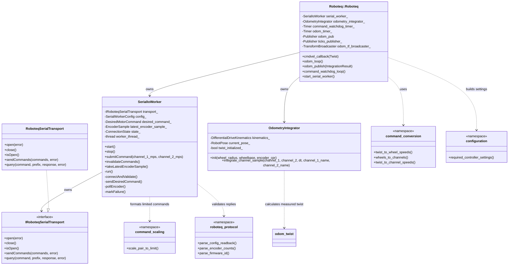
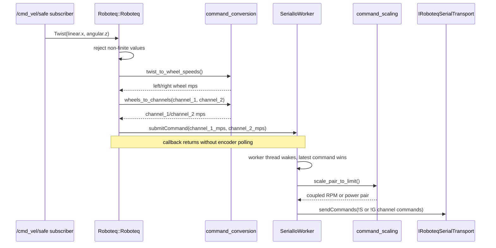
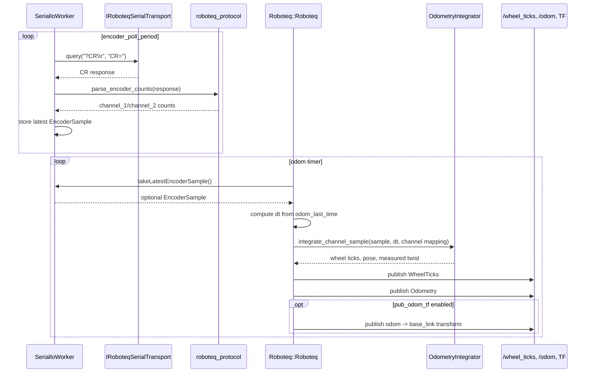
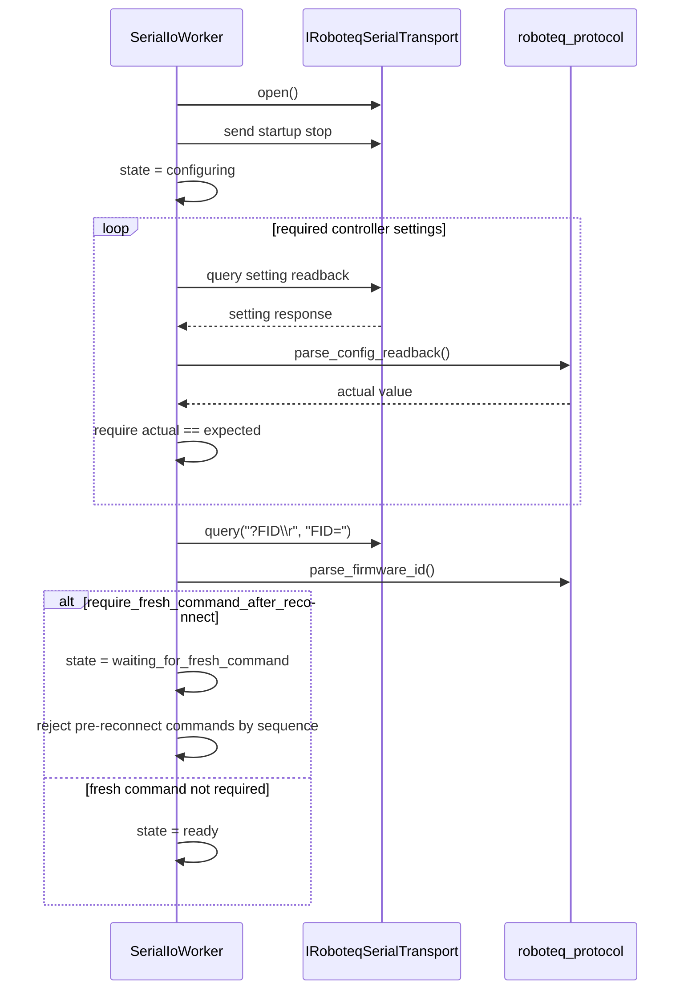
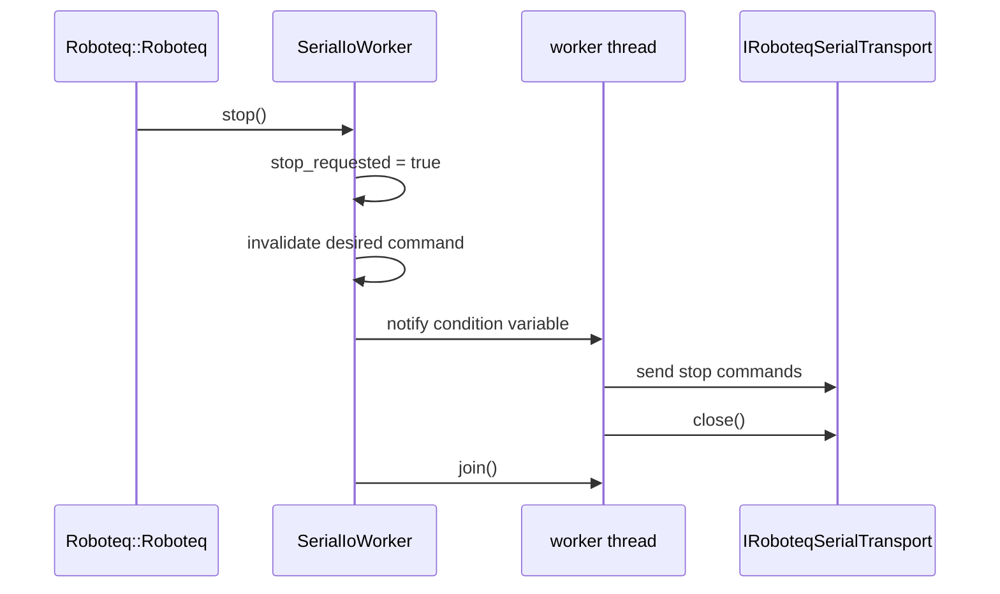
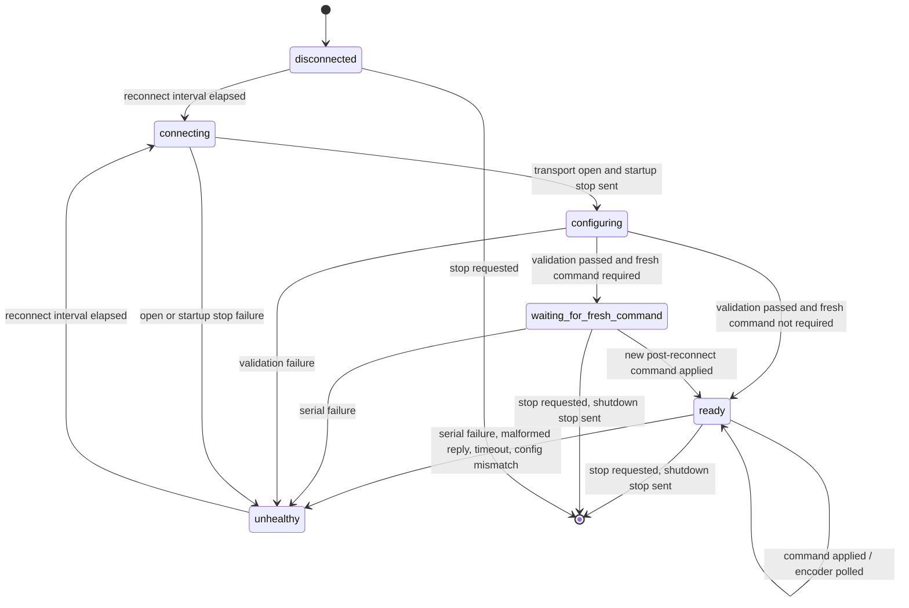

# Roboteq Driver Refactor Architecture

This document describes the behavior-preserving Roboteq driver decomposition. It is intended to match the implementation in `src/roboteq_ros2_driver` after the serial I/O worker and component extraction refactors.

## Ownership Boundaries

- `Roboteq::Roboteq` owns ROS parameters, subscriptions, timers, publishers, odometry messages, and TF publication.
- `roboteq_ros2_driver::SerialIoWorker` is the only component that owns and calls the serial transport.
- `roboteq_ros2_driver::RoboteqSerialTransport` wraps the concrete serial port access.
- `roboteq_ros2_driver::command_conversion` converts `/cmd_vel/safe` twists to left/right wheel speeds and then to configured Roboteq channels.
- `roboteq_ros2_driver::command_scaling` applies coupled saturation inside the worker command formatting path.
- `roboteq_ros2_driver::configuration` builds the required controller readback validation table.
- `roboteq_ros2_driver::odometry::OdometryIntegrator` maps channel encoder samples to wheel ticks and integrates pose/twist.
- `odom_covariance`, `odom_tf`, `odom_twist`, `roboteq_protocol`, and `command_watchdog` remain focused helper modules.

## Class Diagram



## Motor Command Sequence



## Encoder And Odometry Sequence



## Reconnect Sequence



## Shutdown Sequence



## Controller State Machine



## Preserved Behavior And Safety Notes

- Command input remains `/cmd_vel/safe`.
- Default channel ownership remains `channel_1 = right`, `channel_2 = left`.
- Reverse steering is preserved in `command_conversion::twist_to_wheel_speeds`.
- Wheel radius, wheelbase, encoder PPR/CPR, encoder sign correction, motor direction, command timeout, joystick timeout behavior, odometry math, covariance, and TF behavior are unchanged by this decomposition.
- Runtime controller configuration is read back and verified by `SerialIoWorker`; the worker does not blindly overwrite required controller settings.
- Serial ownership remains single-threaded: ROS callbacks interact with `SerialIoWorker` through synchronized state, while only the worker thread calls the transport.
- Slow or malformed encoder readback cannot execute inside the command callback path. It can still make the worker enter reconnect, which sends a stop, closes the transport, invalidates commands, and waits for a fresh command if configured.

## Validation Results

Agent 3 ran targeted validation on branch `codex-pharmarobot-safe` without hardware commands, without `/dev/roboteq` writes, without `ros2 launch`, without `ros2 run`, and without publishing velocity commands.

Commands:

```bash
source /opt/ros/foxy/setup.bash && colcon build --packages-select roboteq_ros2_driver
source /opt/ros/foxy/setup.bash && colcon test --packages-select roboteq_ros2_driver --ctest-args -R "test_command_conversion|test_roboteq_configuration|test_roboteq_odometry|test_roboteq_protocol|test_serial_worker|test_command_scaling|test_odom_twist|test_odom_covariance|test_odom_tf|test_command_watchdog"
source /opt/ros/foxy/setup.bash && colcon test-result --verbose
```

Result:

```text
Summary: 67 tests, 0 errors, 0 failures, 0 skipped
```
