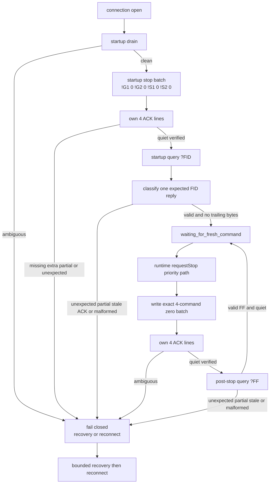

# roboteq_ros2_driver

ROS2 driver for the Roboteq SDC21xx, HDC24xx family of motor controllers in a differential-drive configuration.
Initially developed for SDC21xx and HDC24xx, but could work with other roboteq dual-channel motor drivers.

Subscribes to cmd_vel, publishes to odom

Does not require any MicroBasic script to operate.

## Usage

This repository builds the driver in the ROS 2 Humble Docker workspace. The
`serial` package is included in this workspace and is built with the driver.

From inside `pharma_container`:

    cd /ros_ws
    source /opt/ros/humble/setup.bash
    colcon --log-base /tmp/roboteq_doc_log build \
      --merge-install --symlink-install \
      --packages-up-to roboteq_ros2_driver \
      --build-base /tmp/roboteq_doc_build \
      --install-base /tmp/roboteq_doc_install

The normal robot bring-up path is `teleop_pharma/control_only.launch.py`, which
starts joystick input, command arbitration, and this driver with
`config/roboteq.yaml`. Direct `ros2 run` or `ros2 launch` use can access the
Roboteq serial device and must follow the repository hardware approval rules.

## Encoder response parsing safety

Encoder count responses from the Roboteq controller are parsed as strict
`CR=<int>:<int>` protocol messages. The runtime driver uses the same parser
covered by `test_roboteq_protocol`.

Malformed encoder responses are rejected instead of being partially accepted.
For example, partial numeric fields such as `CR=12x:34` or `CR=12:34y`,
empty fields, unexpected prefixes, out-of-range integers, extra separators,
explicit rejection replies, and leading/trailing whitespace around numeric
responses are invalid. Invalid encoder responses are not published as valid
zero motion; the serial worker marks the transaction failed and the odometry
publishing path waits for the next validated encoder sample.

This parser robustness change is limited to rejecting malformed encoder input.
It does not intentionally change motor-command generation, serial write
commands, launch files, hardware parameters, or safety logic.

## Startup controller configuration validation

Normal runtime startup validates required Roboteq controller settings by
readback instead of blindly overwriting persistent controller configuration.
The driver sends the existing conservative zero-stop commands first, then
queries required settings such as `MMOD`, `ALIM`, `MXRPM`, `MAC`, `MDEC`,
`KP`, `KI`, `KD`, `EPPR`, `ECHOF`, and `RWD`.

Each readback must parse as `<setting>=<int>` and match the expected value
derived from the ROS parameters and driver constants. If a setting is missing,
malformed, unreadable, or mismatched, startup logs the failing setting, sends a
stop command where possible, closes the serial port, and aborts normal runtime
startup. `cmd_vel` commands are rejected unless controller configuration has
validated successfully.

This separates commissioning from runtime startup. Commissioning tools should
set persistent Roboteq parameters before this node is started; this node now
reports mismatches instead of silently changing them. Motor command generation,
wheel geometry, channel assignment, encoder sign, launch files, serial port
names, and emergency stop behavior are not intentionally changed by this
validation path.

Manual validation on real Roboteq hardware is still required to confirm the
controller firmware returns configuration queries in the expected
`<setting>=<int>` format.

## Dynamic odometry TF

When `pub_odom_tf` is true, the driver publishes a dynamic `odom -> base_link`
transform from the same wheel-odometry pose used for `/odom`. The transform
uses the odometry message timestamp, `odom_frame` as the parent frame,
`base_frame` as the child frame, x/y translation from odometry, z translation
set to zero, and the odometry yaw quaternion. The default runtime
configuration enables this with `odom_frame: "odom"` and
`base_frame: "base_link"`.

This does not add or restore a static odom transform. Existing odometry math,
encoder signs, wheel geometry, motor command generation, serial behaviour and
safety logic are unchanged. Runtime TF graph validation on the robot is still
required before enabling SLAM.

## Odometry twist output

The `/odom` publisher fills `odom.twist.twist.linear.x` and
`odom.twist.twist.angular.z` from measured encoder odometry instead of leaving
them at zero. Linear velocity is calculated from the encoder-derived forward
displacement over the odometry update `dt`. Angular velocity is calculated from
the normalized yaw delta over the same `dt`, so yaw wraparound across
`+pi/-pi` does not create a velocity spike.

The first valid odometry sample and any cycle with invalid, non-finite, or
non-positive `dt` publish zero twist. Encoder read failures still skip odometry
publication for that cycle. Non-planar twist fields remain zero.

This change does not alter pose integration, dynamic TF publication, encoder
signs, wheel radius, wheel separation, channel assignment, motor command
generation, serial behaviour, or safety logic. Manual validation on the robot
is still required to confirm `/odom` twist values match observed motion.

## Serial I/O separation

The driver now separates ROS callback work from Roboteq serial I/O with a
single dedicated serial worker thread. The old runtime model used direct serial
writes in `/cmd_vel/safe`, direct stop writes from the watchdog/destructor, and
encoder polling from the odometry timer. Those paths shared one mutex, but slow
serial reads, malformed replies, or read timeouts could still delay command
handling.

The new runtime model is:

    ROS callbacks
        -> thread-safe latest desired motor command
        -> single serial I/O worker
        -> fakeable Roboteq serial transport
        -> strict protocol parser
        -> thread-safe latest encoder sample
        -> ROS wheel-tick and odometry publishing

Ownership rules:

    ROS callback thread:
      - validates `/cmd_vel/safe`
      - preserves the existing differential-drive and channel mapping logic
      - updates latest desired command state only

    Serial worker:
      - exclusively owns the Roboteq serial transport and `serial::Serial`
      - opens and closes the connection
      - sends startup, timeout, reconnect, command, and shutdown stops
      - validates required controller configuration by readback
      - validates communication with a real query response
      - sends latest motor commands
      - polls encoders
      - handles serial failure and reconnect timing

    ROS publishing path:
      - reads the latest validated encoder sample
      - publishes `/wheel_ticks` and `/odom`
      - does not access serial

Commands use latest-command-wins semantics instead of an unbounded queue. The
worker sends a motor command when a fresh sequence is available, sends one stop
on command timeout, and avoids resending stale commands unnecessarily. After a
serial failure or reconnect, commands received before or during the disconnect
are invalidated; non-zero motion requires a fresh post-reconnect
`/cmd_vel/safe` message.

The installed SBL2360 was characterized before selecting the reply-ownership
policy. H1 observed one `+\r` acknowledgement after every individual zero
command in 80/80 attempts. H2 observed exactly four acknowledgements after the
exact four-command stop batch in 30/30 attempts. H3 collected those four lines,
required a 20 ms quiet interval, and then received the owning `FID=...\r` or
`FF=...\r` query reply without contamination in 40/40 attempts.

Production therefore uses one synchronous transaction owner and one shared line
classifier. A command batch is written in full before reply collection begins;
it then owns exactly one `+\r` per command within a 50 ms absolute deadline, a
20 ms post-final-ACK quiet interval, and a 64-byte cap. Missing, extra, partial,
malformed, delayed, or typed query lines during ACK collection make ownership
unresolved. Queries never skip ACKs or unrelated typed lines: they own one
validated expected reply followed by bounded quiet verification. Unresolved
ownership blocks normal traffic, invalidates motion, and enters one bounded
drain/synchronization attempt before reconnect fallback.

The architecture review compared five policies. Per-command ACK waiting (A)
adds avoidable delay between the four safety writes. Stop-only batch collection
(B) leaves ordinary motion-command replies without an owner. A fully
asynchronous parser/arbiter (C) resolves ownership but adds concurrency and
lifecycle complexity not justified by the observed ordered controller stream.
Drain-and-resynchronize after every stop (D) can discard provenance-bearing
replies and hide a controller or transport fault. The selected hybrid
transaction-owner policy (E) keeps the simpler single worker and synchronous
transport, writes the stop batch without inter-command waits, then owns its
bounded ACK set before allowing any query or normal traffic.

The command deadline and caps use conservative margins over the installed
controller evidence. The 50 ms absolute ACK deadline is approximately nine
times the H2 maximum complete-burst latency of 5.548 ms while still containing
the required 20 ms post-final-ACK quiet interval. The 64-byte cap is eight times
the expected eight-byte `+\r+\r+\r+\r` stop reply. The normal 100 ms query
deadline and existing recovery bounds (100 ms delayed-reply horizon, 120 ms
absolute drain, 20 ms drain quiet, 100 ms synchronization, and 50 ms post-sync
check) are retained from the earlier bounded diagnostic evidence rather than
being weakened by the faster ACK observations.

Staged production tracing later proved a separate startup-validation issue in
the query helper rather than in the controller or serial protocol. The startup
path could write `?FID\r`, receive and classify the complete expected
`FID=Roboteq v1.8d SBL2XXX 1/8/2018\r` reply, and still return failure because
post-reply quiet verification hit its absolute diagnostic-drain deadline
without receiving any further bytes. Production now treats a valid expected
reply plus quiet expiry with no trailing bytes as synchronized success. The
path still fails closed on partial trailing bytes, unexpected complete lines,
duplicate or malformed replies, ACK contamination, stale bytes, byte-cap
overflow, or absence of the expected reply before the query deadline.

### Phase 5B completed startup and stop path

The implemented Option E startup and runtime stop sequence is:

1. Passively drain startup bytes under bounded quiet/absolute/byte limits.
2. Write the exact four-command zero batch: `!G 1 0`, `!G 2 0`, `!S 1 0`,
   `!S 2 0`.
3. Own exactly four `+\r` acknowledgement lines.
4. Require the post-ACK quiet boundary before any query.
5. Send startup `?FID\r` and require one classified expected reply.
6. Enter `waiting_for_fresh_command` only after the validated startup query.
7. On runtime stop, write the same exact four-command zero batch.
8. Own exactly four `+\r` acknowledgement lines for that measured stop.
9. Send post-stop `?FF\r` for synchronization/diagnostic confirmation.
10. Fail closed into bounded recovery and reconnect if any ownership or query
    ambiguity remains unresolved.

The validation stages for this sequence were:

- H1: 80/80 individual zero commands returned exactly one `+\r`.
- H2: 30/30 exact four-command stop batches returned exactly four `+\r`
  lines.
- H3: 40/40 stop-batch-followed-by-query transactions returned four owned
  ACKs and then a clean `FID=` or `FF=` reply with no contamination.
- Staged diagnosis: raw query, individual-ACK, full-batch, and stop-then-query
  hardware checks isolated startup/query helper behavior from hardware.
- One-attempt production regression: startup drain, startup stop, `?FID\r`,
  measured stop, and post-stop `?FF\r` succeeded on the production path after
  the query-helper correction.
- Final Phase 5B batch: 30/30 production attempts passed in
  `validation_evidence/roboteq-final-phase5b-stop-ff-20260715T134630Z/00-final-phase5b-stop-ff.jsonl`
  with SHA-256
  `d3c6750ca92b37bc540a16fff05ebf5f8fa9d54e09d924c099481b1a7a19223a`.

Final Phase 5B hardware evidence established:

- startup drain was clean;
- startup stop owned exactly four `+\r` ACKs;
- startup `?FID\r` validation succeeded;
- the worker reached `waiting_for_fresh_command`;
- all 30 measured stops owned exactly four `+\r` ACKs;
- all post-stop diagnostics returned exactly `FF=0\r`;
- final framing remained synchronized;
- stop-write latency min/median/p95/max was 6.477/7.321/8.137/8.166 ms.

That latency measures `requestStop()` to serial-library/OS write acceptance of
the complete zero batch only. It does not establish controller execution time,
physical wheel stop time, or STO actuation.

### Continuing-runtime stop validation seam

`SerialIoWorker::requestStop()` is a continuing-runtime safety request; unlike
`stop()`, it does not terminate or join the worker. One pending bit is used, so
repeated requests coalesce under the same correlation ID and cannot create an
unbounded queue. Requesting a stop immediately invalidates the desired command
and raises the minimum acceptable motion sequence. The worker services the bit
before command, encoder, diagnostic, or recovery work and emits only the exact
four-command production zero batch: `!G 1 0`, `!G 2 0`, `!S 1 0`, and
`!S 2 0`. Commands submitted before completion of that stop are invalidated;
motion requires a later fresh command.

If a runtime stop becomes pending after the loop's initial priority check but
before bounded diagnostic recovery begins, recovery entry is deferred until the
next loop iteration so the pending stop still executes before that recovery
attempt starts.

A diagnostic timeout still permits exactly one bounded recovery attempt. The
transport drains until the configured absolute/quiet/byte bounds, validates any
delayed reply, and calls back into the worker before writing the distinct
synchronization query. A pending stop is completed at that checkpoint, then the
same recovery resumes. A partial stop write, write timeout, invalid drained
framing, failed synchronization, or ambiguous post-synchronization bytes fails
the attempt and enters the existing stop/close/reconnect path. Reconnect
invalidates prior state and returns to `waiting_for_fresh_command`.

The transport no longer calls `serial::Serial::flush()`, whose POSIX
implementation uses unbounded `tcdrain()`. “Transmit completion” in worker and
validation observations means that every byte was accepted by the serial
library/operating-system write path. It does not mean physical UART
transmission, controller execution, or physical stopping. Each write is bounded by the serial timeout configured by this
driver as `max(serial_read_timeout_ms, serial_write_timeout_ms)`; therefore the
four independent writes in a stop batch have a write-path bound of four times
that timeout, excluding scheduler delay. A partial return, exception, or
timeout is a transport failure and triggers recovery/reconnect handling. Stop
observers report `write_accepted` and 28 bytes only after the complete four-command
batch was accepted; ACK ambiguity after a complete write is reported separately
through framing/recovery state.

Optional stop and diagnostic observers default to empty and are not set by the
production node. Callbacks run without the worker state mutex, exceptions are
contained, and unused observers do not affect control flow. Events carry
steady-clock timestamps, correlation IDs, connection generations, byte counts,
and diagnostic phases covering selection/write/read, timeout, drain,
synchronization, fallback, and reconnect. Testing delays or barriers held by an
observer are synthetic fault injection and are excluded from normal latency.

The default-disabled Phase 5B harness and its restrictions are documented in
`tools/phase5b/README.md`. Its injected fallback evidence is labelled
`synthetic reconnect-fallback path validation` and cannot be represented as a
naturally ambiguous physical-controller reply. When a preselection or normal
attempt reaches unresolved diagnostic framing after a valid stop sample, the
harness records that partial result explicitly instead of waiting for an
unreachable normal terminal phase.

New serial parameters:

    serial_read_timeout_ms: 50
    serial_write_timeout_ms: 50
    serial_transaction_timeout_ms: 100
    serial_max_response_bytes: 256
    serial_reconnect_interval_s: 1.0
    encoder_poll_period_ms: 50
    require_fresh_command_after_reconnect: true

These are the node defaults. The production `config/roboteq.yaml` currently
overrides `serial_transaction_timeout_ms` to 500 ms; the node default remains
100 ms. That production override predates the fail-fast validation work and is
preserved unchanged by it.

## Fail-fast safety-critical parameter validation

Before odometry setup, ROS publishers/subscribers/timers, serial transport
construction, or serial-worker construction/start, the node validates all
safety-critical driver parameters. Invalid configuration produces a FATAL log
that names the parameter and aborts node construction. It cannot open the
transport, create/start the worker, validate controller settings, or send a
controller or motion command. Invalid timeout, size, and interval values are
rejected rather than silently replaced with defaults.

Validated parameters are:

    port: non-empty
    baud: positive
    wheel_radius, wheelbase: finite and positive
    encoder_ppr, encoder_cpr: positive
    encoder_eppr: non-zero magnitude, excluding INT_MIN
    motor_sign_1, motor_sign_2: exactly -1 or 1
    encoder_sign_1, encoder_sign_2: exactly -1 or 1
    command_angular_sign: exactly -1 or 1
    max_amps: finite and positive
    max_rpm: positive
    cmd_timeout_s: finite and positive
    serial_read_timeout_ms, serial_write_timeout_ms: positive
    serial_transaction_timeout_ms, serial_max_response_bytes: positive
    serial_reconnect_interval_s: finite and positive
    encoder_poll_period_ms: positive
    diagnostics_publish_rate_hz: finite and positive
    channel_1, channel_2: one "left" and one "right"

The only upper bounds enforced are software representation bounds already
implied by the implementation: `max_amps * 10` must fit in an `int`, and
seconds-to-milliseconds conversions for command timeout and reconnect interval
must fit in an `int`. No hardware upper limit is imposed because this repository
does not contain an authoritative controller or robot-specific maximum for
wheel geometry, CPR/PPR, RPM, current, baud, response size, or timing values.

The current node defaults and production YAML use `+1` for both motor sign
parameters and `+1` for both encoder sign parameters. The production YAML also
uses `encoder_eppr: -1024` and `command_angular_sign: 1`. Changing any sign or
encoder direction parameter changes motor direction, encoder convention, or
angular command convention and requires separate safety approval and controlled
hardware validation.

This change intentionally preserves command conversion, command scaling,
saturation, odometry math, covariance, dynamic TF, frame IDs, encoder signs,
motor direction, wheel radius, wheel separation, `/cmd_vel/safe`, and current
controller configuration. Valid production parameter values and their runtime
behavior reflect the current validated mapping: channel 1 maps to the left
wheel, channel 2 maps to the right wheel, and `command_angular_sign` is `+1`.
The four sign parameters are explicit and default to the current production
convention.

### Validation commands

Run current validation in the ROS 2 Humble Docker workspace:

    docker exec pharma_container bash -lc '
      cd /ros_ws
      source /opt/ros/humble/setup.bash
      colcon --log-base /tmp/roboteq_doc_log build \
        --merge-install --symlink-install \
        --packages-up-to roboteq_ros2_driver \
        --build-base /tmp/roboteq_doc_build \
        --install-base /tmp/roboteq_doc_install
    '

    docker exec pharma_container bash -lc '
      cd /ros_ws
      source /opt/ros/humble/setup.bash
      source /tmp/roboteq_doc_install/setup.bash
      colcon --log-base /tmp/roboteq_doc_log test \
        --merge-install \
        --packages-select roboteq_ros2_driver \
        --build-base /tmp/roboteq_doc_build \
        --install-base /tmp/roboteq_doc_install \
        --ctest-args -R "test_command_watchdog|test_roboteq_protocol|test_serial_worker|test_serial_transport|test_command_scaling|test_command_conversion|test_roboteq_configuration|test_roboteq_diagnostics|test_roboteq_odometry|test_driver_parameter_validation|test_odom_tf|test_odom_twist|test_odom_covariance"
      colcon --log-base /tmp/roboteq_doc_log test-result \
        --test-result-base /tmp/roboteq_doc_build --verbose
    '

Current lint status: functional gtests pass, but full package lint currently
reports pre-existing `cpplint` include-order failures in
`include/roboteq_ros2_driver/roboteq_ros2_driver.hpp`.

    docker exec pharma_container bash -lc '
      cd /ros_ws
      source /opt/ros/humble/setup.bash
      source /tmp/roboteq_doc_install/setup.bash
      colcon --log-base /tmp/roboteq_doc_log test \
        --merge-install \
        --packages-select roboteq_ros2_driver \
        --build-base /tmp/roboteq_doc_build \
        --install-base /tmp/roboteq_doc_install \
        --event-handlers console_direct+
      colcon --log-base /tmp/roboteq_doc_log test-result \
        --test-result-base /tmp/roboteq_doc_build --verbose
    '

Configuration provenance is limited to repository defaults and the production
YAML values. This repository does not record the robot serial number,
controller model and firmware, parameter source, calibration date, measurement
uncertainty, or an authoritative hardware limit record. Those omissions are why
the validator enforces only existing software representation/conversion bounds
and does not invent upper hardware limits.

### Deferred integration and hardware validation

Agent 6 defined, but did not execute, these additional levels:

1. Level 0: run an offline component with an injected counting transport or
   PTY in an isolated workspace. Invalid cases must log FATAL and leave ROS
   entity, transport/open, worker, controller, and motion counters at zero;
   valid configuration must proceed. This is the recommended next evidence.
2. Level 1: keep the controller disconnected and replace the production serial
   path with an audited sentinel/proxy. Invalid cases must produce zero opens
   and zero bytes; valid configuration may open only after validation and must
   emit no motion bytes. Use this when deployment-path confidence is needed.
3. Level 2: connect a representative controller only with STO asserted, motor
   power isolated where possible, wheels elevated and secured, and external
   commands disabled. Invalid cases must create no controller connection or
   bytes; valid startup must be normal with no unsolicited motion. This is
   optional commissioning evidence.

Levels 0 and 1 require separate ROS/runtime or serial-path approval. Level 2
requires explicit hardware approval. Broader hardware validation remains
deferred unless separately approved; Phase 5B completed the production
stop/write-acceptance scope, but reconnect behavior outside that scope,
odometry feedback timing, and physical safety-chain behavior remain unverified
here.

## Odometry covariance

The `/odom` publisher uses explicit diagonal covariance parameters for
`nav_msgs/msg/Odometry`. Pose covariance is ordered as
`[x, y, z, roll, pitch, yaw]`; twist covariance is ordered as
`[linear.x, linear.y, linear.z, angular.x, angular.y, angular.z]`. The diagonal
indices are `0`, `7`, `14`, `21`, `28`, and `35`; all off-diagonal entries are
zero.

Default conservative fallback variances:

    odom_pose_covariance_x: 0.05
    odom_pose_covariance_y: 0.10
    odom_pose_covariance_z: 1000000.0
    odom_pose_covariance_roll: 1000000.0
    odom_pose_covariance_pitch: 1000000.0
    odom_pose_covariance_yaw: 0.25
    odom_twist_covariance_linear_x: 0.10
    odom_twist_covariance_linear_y: 1000000.0
    odom_twist_covariance_linear_z: 1000000.0
    odom_twist_covariance_angular_x: 1000000.0
    odom_twist_covariance_angular_y: 1000000.0
    odom_twist_covariance_angular_z: 0.50

The observed planar wheel-odometry DOFs are pose `x`, `y`, `yaw` and twist
`linear.x`, `angular.z`. Unobserved DOFs use high covariance: pose `z`, `roll`,
`pitch` and twist `linear.y`, `linear.z`, `angular.x`, `angular.y`. Negative,
NaN, or infinite covariance parameters are sanitized during odometry setup and
replaced with the conservative default for that field.

These defaults are not calibrated robot-specific values. To calibrate them,
record ground-truth and wheel-odometry trajectories over representative
straight, reverse, turning, and mixed-motion runs. Compute the odometry error
variance for pose and twist terms, then configure the measured variances with a
safety margin. Keep unobserved DOFs high unless another sensor independently
measures them.

This change does not alter pose integration, twist calculation, dynamic TF,
encoder signs, wheel radius, wheel separation, channel assignment, motor
command generation, serial behaviour, or safety logic. Manual validation on the
robot is still required before relying on the covariance values for SLAM,
localization, or sensor fusion.

## Coupled wheel command saturation

The `cmd_vel` to Roboteq command conversion scales left and right wheel
commands together when either wheel would exceed the configured limit. In
closed-loop mode the shared limit is `max_rpm`; in open-loop mode the shared
motor-power limit is `1000`.

This replaces independent per-wheel clipping. If a mixed linear/angular command
would saturate one side, both wheel commands are reduced by the same factor so
the requested left/right ratio and curvature are preserved as closely as
possible before the existing integer command conversion.

This change does not alter motor direction, channel assignment, encoder sign,
wheel radius, wheel separation, command timeout handling, serial port names, or
emergency stop behavior. Manual validation on the robot is still required before
using new operating envelopes with real motors.

## Parser, serial worker, TF, twist, covariance and command scaling validation

The focused Humble validation commands above cover Roboteq protocol parsing,
the serial worker, command watchdog, odometry TF, odometry twist, odometry
covariance, diagnostics, and command scaling.

The serial worker tests use a fake transport. They verify worker-only transport
access, non-blocking command submission during slow serial writes, encoder
sample handoff, latest-command-wins behavior, malformed encoder response
rejection, one timeout stop path, reconnect command invalidation, and fresh
post-reconnect command application.

Phase 5A adds offline stop-path latency coverage with an optional, normally
unset timeout-stop observer on the production serial worker. The observer
reports monotonic `std::chrono::steady_clock` timestamps for timeout detection,
zero-write start, and zero-write completion, correlated by the timed-out command
sequence. Observer exceptions are contained and no production node configures
the observer, so the seam does not change scheduling, serial, timeout, command
priority, or reconnect behavior when unused.

The fake transport records each write's start, completion, success, and exact
command batch. Focused tests inject a known write delay and directly measure
timeout-detection to zero-command-write-completion latency. They also verify
bounded completion of the exact zero-stop batch during startup, command timeout,
transport-write failure before reconnect, and shutdown; exactly one timeout
event sequence; correct event/write ordering; no post-timeout non-zero write;
and no stale-command replay. A normal non-timeout command emits no timeout
events.

The required Phase 5A interval is timeout-detected timestamp to zero-write
completion timestamp. It is distinct from stop-request-to-write latency, the
configured diagnostic deadline, total timeout recovery, and reconnect duration.
These tests bound software dispatch plus fake-transport completion on the test
host; they do not measure USB, controller, motor, brake, STO, or physical stop
latency. Their 250 ms test guard is a scheduler/test-harness failure bound, not
a production timeout or safety requirement. The normal diagnostic transaction
deadline candidate remains 100 ms.

Verified Phase 3 timeout/resynchronisation evidence, including immutable file
paths, SHA-256 checksums, and raw framing conclusions, is documented in
`validation_evidence/README.md`.

### Diagnostic timeout recovery policy

Production serial ownership remains exclusively in `SerialIoWorker`. The
worker now provides an opt-in, one-shot read-only diagnostic request queue;
the driver node does not queue requests, so periodic controller diagnostic
polling is not enabled by this change. The only accepted requests are `?FID`,
`?FF`, `?FM 1`, `?FM 2`, and `?FS` (each terminated by carriage return).

The normal diagnostic-query deadline candidate is 100 ms. A timeout records a
monotonic timestamp, makes that telemetry UNKNOWN, and marks serial framing
unresolved. Normal command, encoder, and diagnostic transactions remain
suspended while framing is unresolved; a pending zero/stop action retains its
higher scheduling priority. The worker then performs exactly one bounded
recovery attempt. It retains drained raw bytes, accepts at most one complete
delayed response matching the timed-out query, and uses a distinguishable
read-only synchronization query (`FF` timeout to `FS`; all other allowed
timeouts to `FF`). Recovery succeeds only for one complete, exact response
with no extra line or trailing bytes.

The delayed-reply drain has a 100 ms horizon from the original query start, a
120 ms absolute limit, a 20 ms quiet period, and a 4096-byte cap. The
synchronization query is limited to 100 ms and 256 bytes; its trailing framing
check uses a 20 ms quiet period, a 50 ms absolute limit, and the same 256-byte
cap. Partial, malformed, oversized, concatenated, wrong-prefix, extra-line, or
deadline-limited results fail recovery and enter the existing reconnect path.
Reconnect advances the connection generation, invalidates old telemetry and
diagnostic state, preserves the fresh-command gate, and never replays a
pre-failure motion command.

This mechanism protects transaction framing and diagnostic data integrity. It
does not grant motion permission and is not a functional-safety or physical
STO mechanism. Hardware safety/STO remains **UNSUPPORTED — external contactor
safety chain is not independently observable through controller telemetry**.

## Lifted-wheel hardware validation

Automated tests do not access `/dev/roboteq` or move motors. Before driving the
AMR after this refactor, validate on real hardware with wheels lifted and the
area clear:

1. Confirm the physical emergency stop and STO path are available.
2. Start the normal safety stack using the approved robot procedure.
3. Verify the Roboteq node connects, sends a startup stop, validates
   controller configuration, and reports serial worker readiness.
4. With the deadman held, send a small forward command through the normal
   `/cmd_vel/safe` chain and confirm both wheels rotate in the expected
   direction.
5. Release the deadman or stop commands and confirm a timeout stop occurs once
   and motion does not resume without a fresh command.
6. Observe `/wheel_ticks`, `/odom`, and dynamic `odom -> base_link` TF for
   plausible updates while wheels turn.
7. Power-cycle or disconnect/reconnect the Roboteq serial device only under a
   safe lifted-wheel procedure. Confirm the driver reconnects stopped and does
   not replay stale pre-disconnect motion.
8. Send a fresh post-reconnect command through the normal safety chain and
   confirm motion resumes only after that fresh command.

## ROS 2 Humble build note

This package is built in ROS 2 Humble using `rosidl_target_interfaces(...)` for
the generated `WheelTicks` message typesupport. The driver header keeps
compatibility includes for both older and newer `tf2_geometry_msgs` header
paths.

## Motor Power Connections

This driver assumes left motor is connected to channel 1 (M1) of the motor
controller, and right motor is connected to channel 2 (M2). It also assumes a
positive speed command will result in forward motion of each motor. Best to
test motor directions using the Roboteq utility software.

## TODO

- [X] Initial ROS2 release with motor commands and odometry stream
- [X] Implement dynamic odometry transform broadcasting with tf2
- [ ] Add roboteq/voltage, roboteq/current, roboteq/energy, and roboteq/temperature publishers
- [X] Make topic names and frames configurable through ROS parameters.
- [X] Make robot geometry and encoder parameters configurable through ROS parameters.
- [X] Make motor controller limits and serial timing configurable through ROS parameters.
- [ ] Implement dynamically enabled self-test mode to verify correct motor power and encoder connections and configuration.

### Hardware note

This repository now contains a completed Phase 5B hardware-validation record
for the approved stop-command ownership and write-acceptance timing scope. It
does not yet contain a complete end-to-end hardware validation record for the
full serial-worker, watchdog, reconnect, odometry, covariance, diagnostics,
and external safety-chain behavior. Broader hardware validation remains a
separate approved step.
[original work for ROS1](https://github.com/ecostech/roboteq_diff_driver)
## Authors

* **Chad Attermann** - *Initial work* - [Ecos Technologies](https://github.com/ecostech)
* **Chase Devitt** - *ROS2 Migration*
# Bounded controller telemetry

The optional `telemetry_enabled` parameter adds controller-side telemetry to the
existing `/diagnostics` stream. It is disabled by default. When enabled, the
single serial worker polls one query at a time (never a second serial reader)
at `telemetry_poll_period_ms`, with `telemetry_query_timeout_ms` as the per-query
deadline and `telemetry_stale_after_ms` as the freshness limit. A pending motor
command, timeout stop, reconnect, or framing recovery always takes priority over
telemetry.

Each complete snapshot contains these exact controller queries for both channels:

`?CIS <n>`, `?M <n>`, `?S <n>`, `?A <n>`, `?P <n>`, `?FM <n>`, plus global `?FF`.

The snapshot is published as `roboteq/channel_1_telemetry` and
`roboteq/channel_2_telemetry` entries in `/diagnostics`, with a shared ROS
timestamp and `sample_time_steady_ns`. `CIS`, applied `M`, measured `S`, current
`A`, power `P`, `FM`, and `FF` are preserved as controller raw integer values;
the driver performs no unit conversion because scaling varies by controller
operating mode and firmware. Invalid, incomplete, timed-out, extra, or stale
replies are never published as valid telemetry and produce an ERROR diagnostic.
