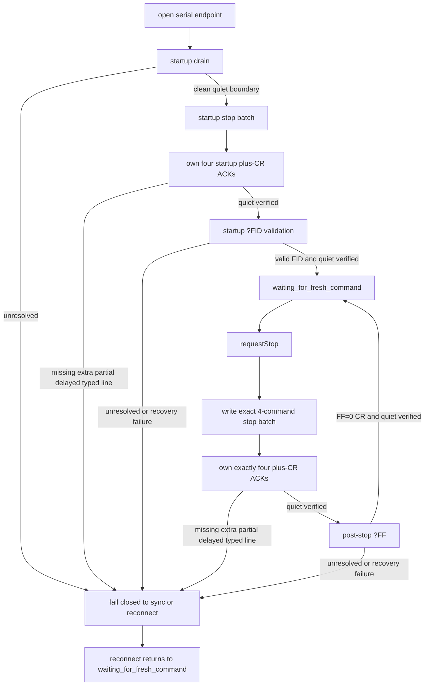

# Phase 5B stop-latency validation harness

This harness is excluded from normal builds. Build it only with
`-DROBOTEQ_BUILD_HARDWARE_VALIDATION=ON`, and execute it only after separate
hardware approval and serial-ownership checks.

The executable has no non-zero motor-command path and accepts no arbitrary
serial command. Its transport wrapper permits only the exact production stop
batch (`!G 1 0`, `!G 2 0`, `!S 1 0`, `!S 2 0`), startup `?FID`, and fixed
read-only `?FF`/`?FS` diagnostic transactions. Controller settings are empty,
periodic encoder polling is deferred for 24 hours, and any unexpected write or
query aborts the run.

Output is a new mode-0600 JSONL file created with `O_EXCL`. Every record is
appended and `fsync`ed. Monotonic timestamps, correlation IDs, connection
generations, diagnostic phases, stop phases, and the serial-write acceptance
byte count are recorded. A successful stop write means the serial library/OS
write path accepted all 28 bytes; it does not prove physical UART transmission.
Every diagnostic query also emits a result record before recovery mutates the
snapshot, so incomplete or unresolved replies preserve their exact raw bytes,
hex encoding, delimiter state, and timestamps in the JSONL evidence.
Preselection and normal scenarios treat unresolved or recovered-after-timeout
diagnostic paths as explicit partial outcomes so a valid stop-latency sample is
preserved without waiting indefinitely for a normal `transaction_complete`.

Observer-triggered barriers or delays are synthetic fault injection and must
not be included in normal hardware-latency populations. The `fallback-injected`
mode overrides a successfully completed recovery result and labels its evidence
exactly `synthetic reconnect-fallback path validation`. It validates the
production reconnect-fallback path; it is not evidence that an SBL2360
naturally produced ambiguous framing.

The command line is intentionally fixed to `/dev/roboteq`, baud 115200, query
`FF` or `FS`, deadline 3 or 100 ms, one of the compiled scenario names, and one
of the compiled phase plans. Each fully expanded command and evidence path
still requires separate approval before execution.

`roboteq_phase5b_ack_characterization` is a separate fixed-mode hardware
evidence tool for command-acknowledgement characterization. It does not import
or modify the production worker or transport reply policy. The tool accepts no
arbitrary serial command. Its only write payloads are `!G 1 0\r`, `!G 2 0\r`,
`!S 1 0\r`, `!S 2 0\r`, and the exact four-command stop batch; its only
read-only follow-up queries are `?FID\r` and `?FF\r` in the compiled H3 modes.
It uses `std::chrono::steady_clock`, records exact transmitted and received raw
bytes, line completion timestamps, inter-line gaps, delimiter state, trailing
partial bytes, and whether any line completed after the H3 query write begins.
Like the stop-latency harness, it creates a new mode-0600 JSONL file with
`O_EXCL`, appends every record, and `fsync`s before continuing.

## Completed Phase 5B record

Phase 5B is complete for the approved production stop-observability scope. The
work closed two issues that mattered to reply ownership:

1. unowned `+\r` ACK contamination risk after the production stop batch; and
2. a query-helper post-reply quiet/deadline bug that could accept a follow-up
   diagnostic without proving the quiet boundary that keeps ownership explicit.

The selected procedure remained Option E: preserve the single worker and
synchronous transport, write the exact four-command stop batch without
inter-command waits, then own the entire bounded ACK set before any diagnostic
or normal traffic resumes.

### Option E production procedure

The completed production-facing procedure is:

1. perform a bounded startup drain immediately after open so startup-banner
   bytes cannot be mis-owned by the first stop transaction;
2. write the exact startup stop batch `!G 1 0\r`, `!G 2 0\r`, `!S 1 0\r`,
   `!S 2 0\r`;
3. own exactly four `+\r` ACK lines for that startup batch;
4. verify the post-ACK quiet interval before the startup query;
5. validate startup identity with `?FID`;
6. enter `waiting_for_fresh_command`;
7. when `requestStop()` becomes pending, write exactly `!G 1 0\r`,
   `!G 2 0\r`, `!S 1 0\r`, `!S 2 0\r`;
8. own exactly four `+\r` ACK lines for that batch;
9. verify the post-ACK quiet interval before any query;
10. measure runtime stop latency from `requestStop()` to full write acceptance;
11. issue post-stop `?FF`;
12. require a clean `FF=0\r` reply with framing still synchronized;
13. fail closed on unresolved ownership or reconnect, and require the worker to
    return to `waiting_for_fresh_command` before any fresh motion command.

### Validation stages

- H1: characterized one `+\r` ACK for each individual zero command.
- H2: characterized exactly four `+\r` ACKs for the exact four-command stop
  batch.
- H3: verified the owned four-ACK stop batch could be followed by an owned
  query reply without contamination.
- staged diagnosis: isolated the startup-drain defect and the query-helper
  post-reply quiet/deadline bug, then re-ran Option E against the corrected
  startup path.
- one-attempt production regression: one production-style stop plus post-stop
  `?FF` validation after the startup fix.
- final 30-attempt batch: repeated production-style runtime stop measurements
  plus post-stop `?FF` validation.

### Final evidence facts

- Evidence file:
  `../../validation_evidence/roboteq-final-phase5b-stop-ff-20260715T134630Z/00-final-phase5b-stop-ff.jsonl`
- SHA-256:
  `d3c6750ca92b37bc540a16fff05ebf5f8fa9d54e09d924c099481b1a7a19223a`
- Result: 30/30 attempts passed.
- Startup drain clean.
- Startup stop owned exactly four `+\r` ACKs.
- Startup `?FID` validation succeeded.
- Worker reached `waiting_for_fresh_command`.
- All measured stops owned exactly four `+\r` ACKs.
- All post-stop `?FF` diagnostics returned `FF=0\r`.
- Final framing synchronized.
- Latency min/median/p95/max:
  6.477/7.321/8.137/8.166 ms.

### Caveats

The Phase 5B latency metric means only `requestStop()` to serial-library or
operating-system write acceptance of the full 28-byte stop batch. It does not
prove physical UART transmission, controller execution, motor torque removal,
physical stopping, or STO behavior.

Phase 4 remains blocked pending validation against the real LiDAR/OSSD/STO
chain. Phase 5B does not prove physical STO behavior and should not be cited as
evidence of the external safety chain.
